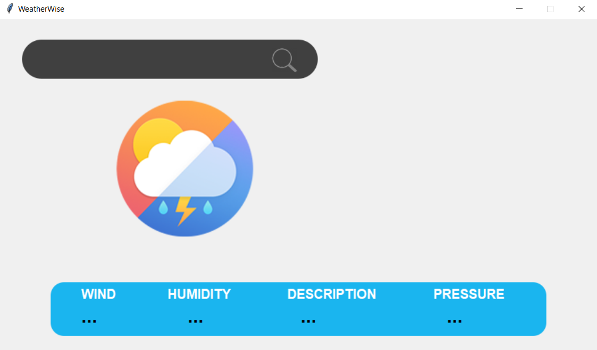

# 🌦️ WeatherWise



**WeatherWise** is a weather application built with Django and Tkinter. This app allows users to check the current weather conditions for various locations worldwide, displaying data such as temperature, humidity, wind speed, and atmospheric pressure.

## 🌟 Features

- 🌐 **User-friendly GUI**: Built with Tkinter for a seamless experience.
- ⏱️ **Real-time Data**: Fetches live weather information from external APIs.
- 📍 **Location-based Search**: Enter any city or location to get weather updates.
- 📊 **Detailed Information**: Displays wind, humidity, description, and pressure.
- 🛠️ **Robust Error Handling**: Manages invalid inputs and API request failures.


## 🚀 Getting Started

### Prerequisites

Make sure you have Python installed. You can download it from [python.org](https://www.python.org/).

### Installation

1. **Clone the repository**:
    ```bash
    git clone https://github.com/abdelhaymallouli/weatherwise.git
    cd weatherwise
    ```

2. **Install the required dependencies**:
    ```bash
    pip install -r requirements.txt
    ```

3. **Run the application**:
    ```bash
    python main.py
    ```

## 📋 Requirements

- `requests==2.31.0`
- `pytz==2023.3`
- `geopy==2.3.0`
- `timezonefinder==6.1.9`
- `Pillow==9.5.0`

## 🛠️ Usage

1. **Start the application**: Run the `main.py` script to launch the Tkinter-based GUI.
2. **Enter a location**: Use the input field to type in the name of a city or location.
3. **Get weather data**: Click the search button to fetch and display the current weather information for the entered location.

## 📁 Project Structure

- `main.py`: The main entry point of the application, setting up the Tkinter window and integrating various components.
- `weather.py`: Contains functions to fetch weather data from external APIs.
- `gui_elements.py`: Contains functions to create and manage the GUI elements of the application.
- `requirements.txt`: Lists all the dependencies required for the project.

## 🤝 Contributing

Contributions are welcome! Please fork the repository, make your changes, and submit a pull request.

1. Fork the Project
2. Create your Feature Branch (`git checkout -b feature/AmazingFeature`)
3. Commit your Changes (`git commit -m 'Add some AmazingFeature'`)
4. Push to the Branch (`git push origin feature/AmazingFeature`)
5. Open a Pull Request

## 📜 License

This project is licensed under the MIT License. See the `LICENSE` file for details.

## 🙏 Acknowledgments

- External weather data provided by [OpenWeatherMap](https://openweathermap.org/) or other weather APIs.
- Icons and images used in the application.
